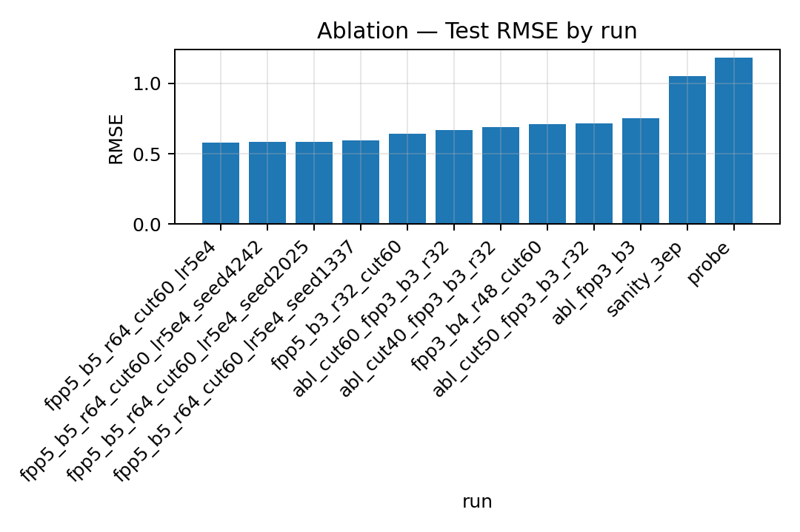
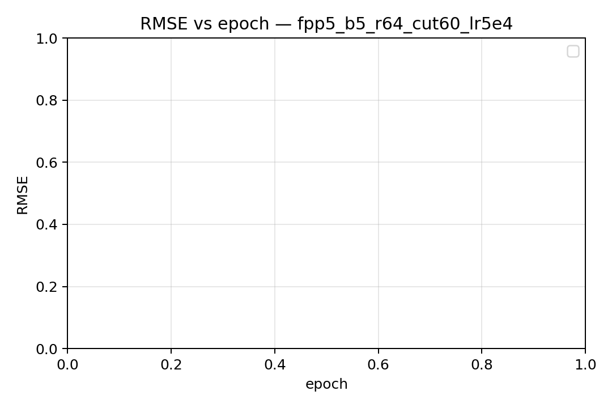

# Explicit-Solvation SchNet for LogS (mol/L)

**Goal :** Predict aqueous solubility **LogS (mol/L)** for a *solute–solvent pair* using **explicit solvation** structures (one atomistic system = solute + solvent).
We train a compact **SchNet-style** GNN on atomistic coordinates, with **temperature-conditioned readout**, and use a **lazy dataset** that streams from a large `.xyz` file via byte offsets.

---

## Table of Contents

1. [Features at a glance](#features-at-a-glance)
2. [Repository structure](#repository-structure)
3. [Data expectations & schema](#data-expectations--schema)
4. [Environment & installation](#environment--installation)
5. [Index the XYZ once (lazy IO)](#index-the-xyz-once-lazy-io)
6. [Training](#training)

   * [Sanity check (1 epoch)](#sanity-check-1-epoch)
   * [Frozen splits for fair ablations](#frozen-splits-for-fair-ablations)
   * [Recommended baseline](#recommended-baseline)
7. [Ablation runner](#ablation-runner)
8. [Results (reproducible)](#results-reproducible)
9. [Inference / prediction](#inference--prediction)
10. [Script & CLI reference](#script--cli-reference)
11. [Performance tips](#performance-tips)
12. [Reproducibility & seeds](#reproducibility--seeds)
13. [Citations & credits](#citations--credits)
14. [License](#license)
15. [Plots](#plots)

---

## Features at a glance

* **Explicit solvation:** model sees the full atomistic system (solute + solvent).
* **Lazy dataset on `.xyz`:** one-time index to byte offsets; stream frames on demand.
* **Per-pair conformer selection:** choose **k lowest-energy frames** per pair to reduce conformational noise.
* **Pair-level split:** prevent leakage across conformers of the same chemical pair.
* **Temperature-aware readout:** FiLM-style modulation by `Temperature_K` (normalized).
* **Mixed precision (AMP):** automatic on CUDA; safe no-op on CPU.
* **Single-command ablations & stability runs** with frozen splits.

---

## Repository structure

```
.
├── README.md
├── requirements.txt
├── .gitignore
├── schnet_data.py            # XYZ indexer + lazy dataset
├── schnet_model.py           # Minimal SchNet (CFConv) + FiLM temperature readout
├── train_schnet.py           # Training & eval; saves y_mu / y_sd in checkpoint
├── predict_schnet.py         # Inference CLI (loads best_model.pt)
└── scripts/
    └── run_ablate.sh         # Cutoff / frames / capacity sweep + summary
```

> **Important:** `train_schnet.py` must save `y_mu` and `y_sd` inside `best_model.pt`:
>
> ```python
> torch.save({"model": model.state_dict(),
>             "args": vars(args),
>             "y_mu": float(y_mu),
>             "y_sd": float(y_sd)}, best_path)
> ```

---

## Data expectations & schema

We assume a single large `.xyz` containing all frames and two CSVs for metadata/labels:

1. **`data/combined_filtered_structures_with_energy.xyz`**

   * Standard multi-frame XYZ.
   * Each frame’s **comment line** contains:

     ```
     mol_<pair>_<frame> | Energy: -14.84 kcal/mol
     ```

     where `<pair>` is a stable **pair_id** and `<frame>` an integer.

2. **`data/pair_map.csv`**

   * Maps `pair_id` to chemistry strings (for analysis; optional for training):

     ```
     pair_id,Solute_SMILES,Solvent_SMILES
     4632,C1=...,O
     ...
     ```

3. **`data/labels_by_pair.csv`**

   * Labels & temperatures at the **pair level**:

     ```
     pair_id,Temperature_K,LogS
     4632,298.15,-3.21
     ...
     ```
   * The loader also accepts `LogS(mol/L)` and renames to `LogS`.

**Index file (created on first run):** `data/xyz_index.csv`

* Columns: `pair_id, frame_id, byte_offset, energy_kcal_per_mol`
* Generated automatically by `train_schnet.py` (or on demand by `predict_schnet.py`).

---

## Environment & installation

> Install **PyTorch** matching your CUDA/driver, then project deps.

```bash
python -m venv .venv
source .venv/bin/activate
pip install -U pip wheel

# Pick ONE of these (examples):
# CUDA 12.1
# pip install --index-url https://download.pytorch.org/whl/cu121 torch torchvision torchaudio
# CUDA 11.8
# pip install --index-url https://download.pytorch.org/whl/cu118 torch==2.2.2 torchvision==0.17.2 torchaudio==2.2.2
# CPU-only (works but slower)
# pip install torch --index-url https://download.pytorch.org/whl/cpu

# Project deps (lightweight)
pip install -r requirements.txt
```

Confirm:

```bash
python - << 'PY'
import torch
print("torch", torch.__version__, "| cuda:", torch.cuda.is_available())
if torch.cuda.is_available(): print("gpu:", torch.cuda.get_device_name(0))
PY
```

---

## Index the XYZ once (lazy IO)

On first run of training or prediction, the code will create `data/xyz_index.csv`.
You can also trigger it explicitly by running `train_schnet.py` once (see below).

---

## Training

### Sanity check (1 epoch)

Use a tiny run to verify env, IO, and splits:

```bash
python train_schnet.py \
  --xyz data/combined_filtered_structures_with_energy.xyz \
  --index_csv data/xyz_index.csv \
  --pair_map_csv data/pair_map.csv \
  --labels_csv data/labels_by_pair.csv \
  --frames_per_pair 1 \
  --batch_size 4 \
  --epochs 1 \
  --lr 1e-3 \
  --hidden 64 --blocks 2 --rbf 16 \
  --cutoff 5.0 \
  --outdir schnet_runs/probe \
  --save_splits schnet_runs/probe/splits
```

This will:

* Create `data/xyz_index.csv` if missing
* Save **frozen split files** to `schnet_runs/probe/splits` (used by all later runs)

### Frozen splits for fair ablations

Always reuse the same split:

```
--load_splits schnet_runs/probe/splits
```

so all runs are apples-to-apples comparable.

### Recommended baseline

```bash
python train_schnet.py \
  --xyz data/combined_filtered_structures_with_energy.xyz \
  --index_csv data/xyz_index.csv \
  --pair_map_csv data/pair_map.csv \
  --labels_csv data/labels_by_pair.csv \
  --frames_per_pair 5 \
  --batch_size 8 \
  --epochs 50 \
  --lr 5e-4 \
  --hidden 128 --blocks 5 --rbf 64 \
  --cutoff 6.0 \
  --num_workers 8 \
  --seed 1337 \
  --outdir schnet_runs/main \
  --load_splits schnet_runs/probe/splits
```

**Outputs in `schnet_runs/main/`:**

* `best_model.pt` *(includes `model`, `args`, `y_mu`, `y_sd`)*
* `test_metrics.json` *(frame-level metrics)*
* `pred_test_by_pair.csv` *(per-pair averaged predictions)*
* `history.json` *(validation curve; early stopping)*

---

## Ablation runner

The script **`scripts/run_ablate.sh`** performs:

* Cutoff sweep (4/5/6 Å) at k=3
* k=5 conformer averaging
* Capacity bump run
* Larger+longer best config
* Prints a summary table (rmse/mae/r²) at the end

Run:

```bash
bash scripts/run_ablate.sh
```

---

## Results (reproducible)

All numbers below were produced with the same **frozen splits** and your data.

### Cutoff sweep (k=3 frames, 128×3×32, 20 epochs, `lr=1e-3`)

| Config                               | RMSE       | MAE        | R²         |
| ------------------------------------ | ---------- | ---------- | ---------- |
| cutoff = **4.0 Å**, k=3, b=3, rbf=32 | 0.6881     | 0.4850     | 0.7072     |
| cutoff = **5.0 Å**, k=3, b=3, rbf=32 | 0.7184     | 0.5207     | 0.6809     |
| cutoff = **6.0 Å**, k=3, b=3, rbf=32 | **0.6697** | **0.4855** | **0.7226** |

**Takeaway:** **6.0 Å** wins in this setting.

### More conformers (k=5 helps)

| Config                                    | RMSE       | MAE        | R²         |
| ----------------------------------------- | ---------- | ---------- | ---------- |
| cutoff=6.0 Å, **k=5**, b=3, rbf=32, 30 ep | **0.6446** | **0.4621** | **0.7430** |

### Capacity bump (did not beat k=5 here)

| Config                                        | RMSE   | MAE    | R²     |
| --------------------------------------------- | ------ | ------ | ------ |
| cutoff=6.0 Å, k=3, **b=4**, **rbf=48**, 20 ep | 0.7121 | 0.5117 | 0.6865 |

### Best single-model run

**Config:** `frames_per_pair=5`, `hidden=128`, `blocks=5`, `rbf=64`, `cutoff=6.0`, `epochs=50`, `lr=5e-4`
**Test (frame-level)**: **RMSE 0.5803**, **MAE 0.3906**, **R² 0.7917**
**Test (pair-avg)**: **RMSE ≈ 0.5616**, **MAE ≈ 0.3726**

<p align="center">
  
  
</p>

### Seed stability (same best config; seeds 1337/2025/4242)

* RMSE: **0.5971**, **0.5863**, **0.5863** → **mean 0.5899 ± 0.0062**
* MAE : **0.4028**, **0.3995**, **0.4013** → **mean 0.4012 ± 0.0016**
* R²  : **0.7795**, **0.7874**, **0.7874** → **mean 0.7848 ± 0.0046**

**Conclusion.** Explicit-solvation SchNet with **cutoff 6.0 Å**, **k=5** lowest-energy frames/pair, and a **5-block** network gives stable test performance around **R² ≈ 0.785–0.792** on held-out pairs.

---

## Inference / prediction

Use `predict_schnet.py` to load `best_model.pt` and predict LogS for target `pair_id`s by averaging over the **k lowest-energy frames** found in your indexed XYZ.

### A) Predict for a curated list of pairs (and optional temperatures)

Create `data/pairs_for_pred.csv`:

```csv
pair_id,Temperature_K
4632,298.15
9662,310.0
9174,298.15
```

Run:

```bash
python predict_schnet.py \
  --checkpoint schnet_runs/main/best_model.pt \
  --xyz data/combined_filtered_structures_with_energy.xyz \
  --index_csv data/xyz_index.csv \
  --pairs_csv data/pairs_for_pred.csv \
  --frames_per_pair 5 \
  --batch_size 8 \
  --outdir predictions/run1
```

Outputs:

* `predictions/run1/pred_by_pair.csv` → **averaged LogS per pair** with `n_frames`
* `predictions/run1/pred_frames.csv` → per-frame predictions before averaging

### B) Predict for all pairs present in the index (default 298.15 K)

```bash
python - << 'PY'
import pandas as pd
idx = pd.read_csv("data/xyz_index.csv")[["pair_id"]].drop_duplicates()
idx["Temperature_K"] = 298.15
idx.to_csv("data/pairs_all_298K.csv", index=False)
print("wrote data/pairs_all_298K.csv with", len(idx), "pairs")
PY

python predict_schnet.py \
  --checkpoint schnet_runs/main/best_model.pt \
  --xyz data/combined_filtered_structures_with_energy.xyz \
  --index_csv data/xyz_index.csv \
  --pairs_csv data/pairs_all_298K.csv \
  --frames_per_pair 5 \
  --outdir predictions/all_298K
```

---

## Script & CLI reference

### `train_schnet.py` (common flags)

* `--xyz` **[path]**: Combined multi-frame `.xyz` (solute+solvent per frame)
* `--index_csv` **[path]**: XYZ index CSV (created if missing)
* `--pair_map_csv` **[path]**: Optional; used for joining SMILES in analyses
* `--labels_csv` **[path]**: Must include `pair_id,Temperature_K,LogS`
* `--frames_per_pair` **[int]**: k lowest-energy frames per pair (default 5)
* `--cutoff` **[Å]**: neighbor cutoff (typ. 4.0–6.0)
* `--hidden` **[int]**: hidden width (64–128 good range)
* `--blocks` **[int]**: number of CFConv blocks (2–5)
* `--rbf` **[int]**: Gaussian RBF count (32–64)
* `--batch_size` **[int]**: systems per step (tune for VRAM)
* `--epochs` **[int]**, `--lr` **[float]**
* `--num_workers` **[int]**: DataLoader workers (0–8 depending on node)
* `--save_splits` / `--load_splits` **[dir]**: persist & reuse pair splits
* `--seed` **[int]**: for reproducibility
* `--outdir` **[dir]**

Outputs:

* `best_model.pt` (weights + args + **`y_mu`/`y_sd`**)
* `test_metrics.json`, `history.json`
* `pred_test_by_pair.csv` (averaged per pair for the test split)

### `predict_schnet.py`

* `--checkpoint` **[path]**: `best_model.pt` from training (must include `y_mu`/`y_sd`)
* `--xyz`, `--index_csv`: same as training
* `--pairs_csv`: CSV with `pair_id` and optional `Temperature_K` (default provided)
* `--frames_per_pair`: k lowest-energy frames to average
* `--batch_size`, `--num_workers`, `--default_T`, `--outdir`

Outputs:

* `pred_frames.csv` (one row per frame)
* `pred_by_pair.csv` (averaged per `pair_id`)

---

## Performance tips

* **Cutoff:** sweep in **[4.0, 6.0] Å** (we found **6.0 Å** best on our data).
* **Frames per pair (k):** 3–10; **k=5** improved stability in our ablation.
* **Longer + lower LR:** `epochs=50`, `lr=5e-4` with `ReduceLROnPlateau` was effective.
* **Mixed precision:** automatic on CUDA; keep it on unless debugging numeric issues.
* **Ensemble (optional):** average 2–3 seed models’ per-pair predictions for small boosts.

---

## Reproducibility & seeds

* Use `--save_splits` once, then **always** `--load_splits` for ablations.
* Fix `--seed` for runs you want to report.
* For stability, run **3 seeds** and report mean ± std.

Example:

```bash
for S in 1337 2025 4242; do
  python train_schnet.py \
    --xyz data/combined_filtered_structures_with_energy.xyz \
    --index_csv data/xyz_index.csv \
    --pair_map_csv data/pair_map.csv \
    --labels_csv data/labels_by_pair.csv \
    --frames_per_pair 5 --batch_size 8 --epochs 50 --lr 5e-4 \
    --hidden 128 --blocks 5 --rbf 64 --cutoff 6.0 --num_workers 8 \
    --outdir schnet_runs/main_seed${S} \
    --seed ${S} \
    --load_splits schnet_runs/probe/splits
done
```

---

## Citations & credits

* **SchNet:** Schütt et al., *SchNet – A continuous-filter convolutional neural network for modeling quantum interactions.*
* **This repo:** minimal SchNet + FiLM temperature conditioning + lazy XYZ loader.

---

## Figures

Run this once after you have training outputs in `schnet_runs/`:

```bash
python scripts/make_figs.py
```

The script will create PNGs in `docs/figs/`:

* `ablation_rmse.png`, `ablation_mae.png`, `ablation_r2.png` — bars aggregating `test_metrics.json` across all runs in `schnet_runs/*/`
* `parity_<best-run>.png` — parity (y_true vs y_pred) on **pair-averaged** test predictions of the best run
* `residuals_<best-run>.png` — histogram of residuals (y_pred − y_true) for the best run
* `curve_<run>.png` — RMSE vs epoch for any run that has a `history.json`
* `seed_stability_[rmse|mae|r2].png` — boxplots if you trained multiple seeds (folders like `..._seed1337`)

### Suggested placements in README

**Results section** (under your tables):

```markdown
<p align="center">
  
</p>
```

**Best model visualization**:

```markdown
<p align="center">
  
  
</p>
```

**Training curve** (if you want to show one run’s curve):

```markdown
<p align="center">
  
</p>
```

> Tip: If your best run folder name is different, just update the `` path accordingly.

---
