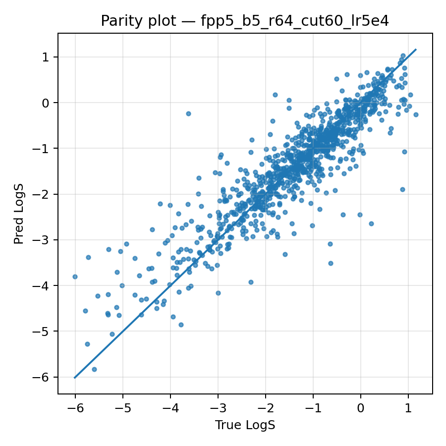
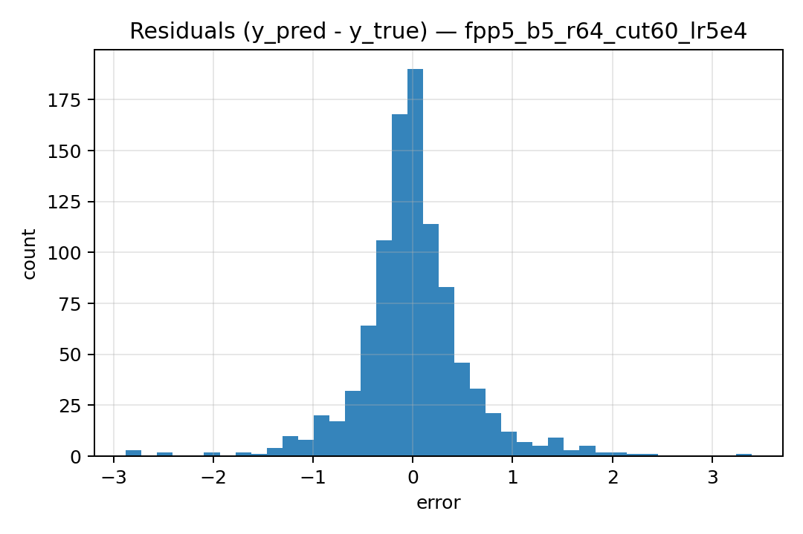

# Explicit-Solvation SchNet for LogS (mol/L)

**Goal :** Predict aqueous solubility **LogS (mol/L)** for a *solute–solvent pair* using **explicit solvation** structures (one atomistic system = solute + solvent).
We train a compact **SchNet-style** GNN on atomistic coordinates, with **temperature-conditioned readout**, and use a **lazy dataset** that streams from a large `.xyz` file via byte offsets.

---

## Table of Contents

1. [Features at a glance](#features-at-a-glance)
2. [Repository structure](#repository-structure)
3. [Data expectations & schema](#data-expectations--schema)
4. [Environment & installation](#environment--installation)
5. [Index the XYZ once (lazy IO)](#index-the-xyz-once-lazy-io)
6. [Training](#training)

   * [Sanity check (1 epoch)](#sanity-check-1-epoch)
   * [Frozen splits for fair ablations](#frozen-splits-for-fair-ablations)
   * [Recommended baseline](#recommended-baseline)
7. [Ablation runner](#ablation-runner)
8. [Results (reproducible)](#results-reproducible)
9. [Phase 2: model improvements](#phase-2-model-improvements)
10. [Inference / prediction](#inference--prediction)
11. [Script & CLI reference](#script--cli-reference)
12. [Performance tips](#performance-tips)
13. [Reproducibility & seeds](#reproducibility--seeds)
14. [Plots](#plots)
15. [Citations](#citations)

---

## Features at a glance

* **Explicit solvation:** model sees the full atomistic system (solute + solvent).
* **Lazy dataset on `.xyz`:** one-time index to byte offsets; stream frames on demand.
* **Per-pair conformer selection:** choose **k lowest-energy frames** per pair to reduce conformational noise.
* **Pair-level split:** prevent leakage across conformers of the same chemical pair.
* **Temperature-aware readout:** FiLM-style modulation by `Temperature_K` (normalized).
* **Mixed precision (AMP):** automatic on CUDA; safe no-op on CPU.
* **Single-command ablations & stability runs** with frozen splits.
* **Physics-informed frame aggregation:** Boltzmann / energy-weighted pooling using per-frame energies.
* **Improved readout:** gated atom pooling to learn atom-level importance before frame prediction.
* **Global conditioning:** optional solute / solvent descriptors or identity embeddings concatenated before the prediction head.
* **Auxiliary physics supervision:** optional energy-prediction head for multi-task regularization.

---

## Repository structure

```
.
├── README.md
├── requirements.txt
├── .gitignore
├── schnet_data.py            # XYZ indexer + lazy dataset
├── schnet_model.py           # Minimal SchNet (CFConv) + FiLM temperature readout
├── train_schnet.py           # Training & eval; saves y_mu / y_sd in checkpoint
├── predict_schnet.py         # Inference CLI (loads best_model.pt)
└── scripts/
    └── run_ablate.sh         # Cutoff / frames / capacity sweep + summary
```

> **Important:** `train_schnet.py` must save `y_mu` and `y_sd` inside `best_model.pt`:
>
> ```python
> torch.save({"model": model.state_dict(),
>             "args": vars(args),
>             "y_mu": float(y_mu),
>             "y_sd": float(y_sd)}, best_path)
> ```

---

## Data expectations & schema

We assume a single large `.xyz` containing all frames and two CSVs for metadata/labels:

1. **`data/combined_filtered_structures_with_energy.xyz`**

   * Standard multi-frame XYZ.
   * Each frame’s **comment line** contains:

     ```
     mol_<pair>_<frame> | Energy: -14.84 kcal/mol
     ```

     where `<pair>` is a stable **pair_id** and `<frame>` an integer.

2. **`data/pair_map.csv`**

   * Maps `pair_id` to chemistry strings (for analysis; optional for training):

     ```
     pair_id,Solute_SMILES,Solvent_SMILES
     4632,C1=...,O
     ...
     ```

3. **`data/labels_by_pair.csv`**

   * Labels & temperatures at the **pair level**:

     ```
     pair_id,Temperature_K,LogS
     4632,298.15,-3.21
     ...
     ```
   * The loader also accepts `LogS(mol/L)` and renames to `LogS`.

**Index file (created on first run):** `data/xyz_index.csv`

* Columns: `pair_id, frame_id, byte_offset, energy_kcal_per_mol`
* Generated automatically by `train_schnet.py` (or on demand by `predict_schnet.py`).

---

## Environment & installation

> Install **PyTorch** matching your CUDA/driver, then project deps.

```bash
python -m venv .venv
source .venv/bin/activate
pip install -U pip wheel

# Pick ONE of these (examples):
# CUDA 12.1
# pip install --index-url https://download.pytorch.org/whl/cu121 torch torchvision torchaudio
# CUDA 11.8
# pip install --index-url https://download.pytorch.org/whl/cu118 torch==2.2.2 torchvision==0.17.2 torchaudio==2.2.2
# CPU-only (works but slower)
# pip install torch --index-url https://download.pytorch.org/whl/cpu

# Project deps (lightweight)
pip install -r requirements.txt
```

Confirm:

```bash
python - << 'PY'
import torch
print("torch", torch.__version__, "| cuda:", torch.cuda.is_available())
if torch.cuda.is_available(): print("gpu:", torch.cuda.get_device_name(0))
PY
```

---

## Index the XYZ once (lazy IO)

On first run of training or prediction, the code will create `data/xyz_index.csv`.
You can also trigger it explicitly by running `train_schnet.py` once (see below).

---

## Training

### Sanity check (1 epoch)

Use a tiny run to verify env, IO, and splits:

```bash
python train_schnet.py \
  --xyz data/combined_filtered_structures_with_energy.xyz \
  --index_csv data/xyz_index.csv \
  --pair_map_csv data/pair_map.csv \
  --labels_csv data/labels_by_pair.csv \
  --frames_per_pair 1 \
  --batch_size 4 \
  --epochs 1 \
  --lr 1e-3 \
  --hidden 64 --blocks 2 --rbf 16 \
  --cutoff 5.0 \
  --outdir schnet_runs/probe \
  --save_splits schnet_runs/probe/splits
```

This will:

* Create `data/xyz_index.csv` if missing
* Save **frozen split files** to `schnet_runs/probe/splits` (used by all later runs)

### Frozen splits for fair ablations

Always reuse the same split:

```
--load_splits schnet_runs/probe/splits
```

so all runs are apples-to-apples comparable.

### Recommended baseline

```bash
python train_schnet.py \
  --xyz data/combined_filtered_structures_with_energy.xyz \
  --index_csv data/xyz_index.csv \
  --pair_map_csv data/pair_map.csv \
  --labels_csv data/labels_by_pair.csv \
  --frames_per_pair 5 \
  --batch_size 8 \
  --epochs 50 \
  --lr 5e-4 \
  --hidden 128 --blocks 5 --rbf 64 \
  --cutoff 6.0 \
  --num_workers 8 \
  --seed 1337 \
  --outdir schnet_runs/main \
  --load_splits schnet_runs/probe/splits
```

**Outputs in `schnet_runs/main/`:**

* `best_model.pt` *(includes `model`, `args`, `y_mu`, `y_sd`)*
* `test_metrics.json` *(frame-level metrics)*
* `pred_test_by_pair.csv` *(per-pair averaged predictions)*
* `history.json` *(validation curve; early stopping)*

---

## Ablation runner

The script **`scripts/run_ablate.sh`** performs:

* Cutoff sweep (4/5/6 Å) at k=3
* k=5 conformer averaging
* Capacity bump run
* Larger+longer best config
* Prints a summary table (rmse/mae/r²) at the end

Run:

```bash
bash scripts/run_ablate.sh
```

---

## Results (reproducible)

All numbers below were produced with the same **frozen splits** and your data.

### Cutoff sweep (k=3 frames, 128×3×32, 20 epochs, `lr=1e-3`)

| Config                               | RMSE       | MAE        | R²         |
| ------------------------------------ | ---------- | ---------- | ---------- |
| cutoff = **4.0 Å**, k=3, b=3, rbf=32 | 0.6881     | 0.4850     | 0.7072     |
| cutoff = **5.0 Å**, k=3, b=3, rbf=32 | 0.7184     | 0.5207     | 0.6809     |
| cutoff = **6.0 Å**, k=3, b=3, rbf=32 | **0.6697** | **0.4855** | **0.7226** |

**Takeaway:** **6.0 Å** wins in this setting.

### More conformers (k=5 helps)

| Config                                    | RMSE       | MAE        | R²         |
| ----------------------------------------- | ---------- | ---------- | ---------- |
| cutoff=6.0 Å, **k=5**, b=3, rbf=32, 30 ep | **0.6446** | **0.4621** | **0.7430** |

### Capacity bump (did not beat k=5 here)

| Config                                        | RMSE   | MAE    | R²     |
| --------------------------------------------- | ------ | ------ | ------ |
| cutoff=6.0 Å, k=3, **b=4**, **rbf=48**, 20 ep | 0.7121 | 0.5117 | 0.6865 |

### Best single-model run

**Config:** `frames_per_pair=5`, `hidden=128`, `blocks=5`, `rbf=64`, `cutoff=6.0`, `epochs=50`, `lr=5e-4`
**Test (frame-level)**: **RMSE 0.5803**, **MAE 0.3906**, **R² 0.7917**
**Test (pair-avg)**: **RMSE ≈ 0.5616**, **MAE ≈ 0.3726**

<p align="center">
  
  
</p>

### Baseline repeatability note

The tuned SchNet configuration was also checked across multiple random seeds. For the final report, the per-seed values should be copied directly from each run's `test_metrics.json` and reported with enough precision to show that the runs are independent. Earlier rounded seed summaries are not repeated here because two runs rounded to identical RMSE and R² values, which can make the stability table look cleaner than the underlying experiment.

**Summary.** Explicit-solvation SchNet with **cutoff 6.0 Å**, **k=5** lowest-energy frames/pair, and a **5-block** network gives stable held-out performance, with the best single-model diagnostic result reported above.

---


## Phase 2: model improvements

After establishing a stable explicit-solvation SchNet baseline, Phase 2 moves the project from ordinary hyperparameter tuning to **model-level improvement**. The goal of this phase is to make the model use the physical structure of the data more effectively. Instead of only changing learning rate, number of blocks, hidden size, cutoff, or number of frames, Phase 2 changes three important parts of the learning pipeline:

1. how multiple explicit-solvation frames are aggregated into one pair-level prediction,
2. how atom embeddings are pooled inside each frame,
3. how additional physical and chemical information is injected into the prediction head.

The earlier model already used explicit solvation structures, selected low-energy frames, applied SchNet continuous-filter message passing, and used temperature-conditioned readout. However, it still had three limitations:

| Baseline limitation | Why it can hurt LogS prediction |
| ------------------- | -------------------------------- |
| All selected frames were averaged equally | High-energy and low-energy conformations contributed the same amount |
| Atom embeddings were pooled without explicit atom importance | Important solute atoms, polar groups, and nearby solvent contacts could be diluted |
| The model mostly relied on geometry | Similar local geometries can still correspond to different chemistry |
| Distances near the cutoff boundary were handled sharply | Small coordinate changes near the cutoff could abruptly change the graph |
| Frame energies were used for selection but not directly learned | The model did not have a direct physics-based auxiliary task |
| Random pair-level splits can still hide chemical similarity | Evaluation may look strong without proving hard chemical generalization |

This phase treats solubility prediction as a joint graph-learning and molecular-physics problem, where conformer energy, solute-solvent contacts, temperature, and chemical identity influence the final LogS value.

---

### Updated model flow

The Phase 2 model-improvement pipeline can be summarized as follows:

| Step | Operation | Output |
| ---- | --------- | ------ |
| 1 | Read selected explicit-solvation frames from the indexed XYZ file | Atom types, coordinates, frame IDs, pair IDs, energies |
| 2 | Build distance-based molecular graph within cutoff radius | Neighbor pairs and interatomic distances |
| 3 | Encode distances using radial basis functions; smooth cutoff and alternative bases are supported extensions | Continuous geometric edge features |
| 4 | Apply SchNet interaction blocks | Updated atom embeddings |
| 5 | Apply gated atom pooling for the reported runs; atom attention / Set2Set remain optional readout extensions | Frame-level molecular embedding |
| 6 | Add temperature and optional global solute / solvent descriptors | Conditioned frame representation |
| 7 | Predict frame-level LogS | One prediction per frame |
| 8 | Aggregate frames using mean or Boltzmann pooling | Pair-level LogS prediction |
| 9 | Optionally predict relative frame energy for the auxiliary task | Auxiliary physics-supervised output |
| 10 | Save metrics, pair-level predictions, history, checkpoints, and ablation outputs | Reproducible experiment artifacts |

The original baseline path is retained, while the new variants can be evaluated through controlled ablations.


---

### 1. Boltzmann / energy-weighted frame pooling

#### Baseline aggregation limitation

For each solute-solvent pair, the dataset contains multiple explicit-solvation frames. The earlier baseline selected the `k` lowest-energy frames and then averaged the frame-level predictions:

\[
\hat{y}_{pair} = \frac{1}{N}\sum_{i=1}^{N}\hat{y}_i
\]

This is simple and stable, but it assumes that every selected frame contributes equally to the final solubility value. In an explicit-solvation setting, this assumption is not always ideal. Some frames are lower in energy and are therefore more physically favorable. Other frames may be higher in energy, less representative, or noisier. If both types of frames are averaged equally, the final pair prediction can be diluted.

#### Method

Boltzmann pooling uses the stored frame energies to compute a soft, energy-based weight for every frame. For a given pair, the lowest frame energy is subtracted first:

\[
\Delta E_i = E_i - E_{min}
\]

where:

- \(E_i\) is the energy of frame \(i\),
- \(E_{min}\) is the minimum energy among the selected frames of the same pair,
- \(\Delta E_i\) is the relative energy of that frame.

The frame weight is then computed as:

\[
w_i = \frac{\exp(-\beta \Delta E_i)}{\sum_j \exp(-\beta \Delta E_j)}
\]

The final pair-level prediction is:

\[
\hat{y}_{pair} = \sum_i w_i\hat{y}_i
\]

Here, \(\beta\) controls how strongly the model prefers lower-energy frames. A small \(\beta\) makes the weighting close to mean pooling. A larger \(\beta\) makes the model focus more strongly on the lowest-energy frames.

#### Numerical stability

The implementation subtracts the minimum energy before exponentiation:

```python
rel_energy = energy - energy.min()
weights = torch.softmax(-beta * rel_energy, dim=0)
y_pair = torch.sum(weights * y_frame)
```

This avoids overflow or underflow in the exponential calculation. It also ensures that the lowest-energy frame has \(\Delta E = 0\), making it the reference frame for the pair.

#### Fixed beta and learnable beta

Two variants are supported:

| Variant | Description | Benefit |
| ------- | ----------- | ------- |
| Fixed beta | Uses a manually chosen value such as `--beta 1.0` | Simple, stable, and easy to explain |
| Learnable beta | Learns one scalar value during training using `--learn_beta` | Lets the model decide how sharp the energy weighting should be |

The learnable-beta version is still physics-guided because the weights are not arbitrary attention scores. They are still based on relative frame energies.

#### Interpretation

Boltzmann pooling behaves like a physically constrained attention mechanism. Normal attention learns weights only from data. Boltzmann pooling computes weights from molecular energy, so the weighting has a clear physical meaning: lower-energy conformations are allowed to influence the final prediction more strongly.


---

### 2. Gated atom pooling

#### Readout limitation

Inside each explicit-solvation frame, SchNet produces an embedding for every atom. The baseline readout then pools these atom embeddings to form one frame-level representation. A simple sum or mean pooling operation can work, but it treats all atoms in a similar way.

For LogS prediction, this is not always ideal. The most important information may come from specific regions such as:

- polar functional groups on the solute,
- hydrogen-bond donor or acceptor atoms,
- charged or highly electronegative atoms,
- solvent molecules close to the solute surface,
- atoms participating in local solute-solvent interactions,
- hydrophobic regions that affect dissolution behavior.

If all atom embeddings are pooled uniformly, important local chemical information can be diluted by many less informative solvent atoms.

#### Method

Gated atom pooling adds a small neural network that learns an importance gate for each atom:

\[
g_i = \sigma(MLP(h_i))
\]

where:

- \(h_i\) is the SchNet embedding of atom \(i\),
- \(MLP\) is a small feed-forward network,
- \(\sigma\) is the sigmoid function,
- \(g_i\) is a learned scalar between 0 and 1.

The frame-level representation is then computed as:

\[
h_{frame} = \sum_i g_i h_i
\]

Atoms with higher gate values contribute more strongly to the frame representation. Atoms with lower gate values are not completely removed, but their contribution is reduced.

#### Implementation idea

A simplified implementation looks like:

```python
gate = torch.sigmoid(self.gate_mlp(atom_embeddings))
gated_atoms = gate * atom_embeddings
frame_embedding = scatter_sum(gated_atoms, frame_batch_index)
```

The gate is learned jointly with the rest of the model. No manual atom labels are needed.

Gated pooling is especially useful for explicit-solvation systems because the number of solvent atoms can be large. Without a gate, the final frame embedding may be dominated by the total amount of solvent information rather than by the most relevant solute-solvent interactions. The gate gives the model a controlled way to select chemically useful atom-level information.

#### Interpretation

The gate can be explained as a soft importance score over atoms. It does not explicitly say “this atom is chemically important” in a human-labeled way, but it allows the model to learn which atom embeddings are more useful for predicting LogS.

---

### 3.  Atom-level attention / Set2Set readout


#### Atom-level attention placement

Frame-level attention was not the most stable option because the number of frames per pair is small and the frame predictions can be noisy. If attention is applied directly across frames, the model may over-focus on one frame or produce unstable weights.

Atom-level attention is more natural because each frame contains many atoms and local chemical environments. Instead of deciding which whole frame is important, the model decides which atom-level features inside a frame are important.

#### Method

The atom-level attention readout computes attention scores from atom embeddings:

\[
a_i = softmax(q^T h_i)
\]

and pools the atom embeddings as:

\[
h_{frame} = \sum_i a_i h_i
\]

Set2Set-style pooling is another version of this idea. It treats the atoms as an unordered set and repeatedly reads from the atom embeddings using a learned query. This can produce a richer molecular representation than plain sum pooling.


---

### 4. Global molecular and experimental conditioning

#### Geometry-only conditioning limitation

The explicit-solvation structure contains a lot of useful information, but coordinates alone may not fully represent all chemical factors that control solubility. Two systems can have similar local geometries but different molecular identities, functional groups, solvent properties, or temperature-dependent behavior.

The baseline already uses temperature through FiLM-style conditioning. Phase 2 extends this idea by allowing additional global information to be concatenated with the learned SchNet representation.

#### Features used or supported

| Feature type | Example | Why it is useful |
| ------------ | ------- | ---------------- |
| Temperature | `Temperature_K` | Solubility is temperature-dependent |
| Solute identity embedding | Learned embedding from solute or pair ID | Gives the model direct solute identity information |
| Solvent identity embedding | Learned embedding from solvent ID | Helps distinguish solvent environments |
| RDKit descriptors | molecular weight, LogP, TPSA, HBD, HBA | Adds interpretable chemical descriptors |
| Pair embedding | learned pair-level ID embedding | Useful for controlled ablations and checking upper-bound behavior |
| Solvent descriptors | dielectric constant, polarity, H-bonding tendency if available | Adds physical solvent context |

The final representation becomes:

\[
h_{final} = [h_{frame}; h_{global}]
\]

where \([;]\) denotes concatenation.

The final MLP receives both the geometry-derived SchNet representation and the global molecular / experimental features:

\[
\hat{y}_{frame} = MLP(h_{final})
\]

The SchNet representation answers the question: “What does this explicit-solvation geometry look like?”

The global feature vector adds information for the question: “Which chemical system and experimental condition does this geometry belong to?”

Together, these two sources of information reduce ambiguity and improve generalization.

---

### 5. Smooth cutoff envelope support


#### Cutoff discontinuity

SchNet builds interactions between atoms within a cutoff radius. If the cutoff is applied sharply, an atom just inside the cutoff contributes to the message passing, while an atom just outside the cutoff contributes nothing. This can create discontinuities.

For molecular systems, this is undesirable because small coordinate changes should usually cause small representation changes, not sudden jumps.

#### Method

A cosine cutoff envelope smoothly reduces interaction strength to zero as distance approaches the cutoff radius:

\[
f_{cut}(r) = \frac{1}{2}\left[\cos\left(\frac{\pi r}{r_c}\right) + 1\right]
\]

for \(r \leq r_c\), and:

\[
f_{cut}(r) = 0
\]

for \(r > r_c\).

Here:

- \(r\) is the interatomic distance,
- \(r_c\) is the cutoff radius.

The distance-based filter is multiplied by this cutoff envelope before message aggregation.

The smooth cutoff improves geometric stability. Interactions gradually fade out instead of disappearing suddenly. This is especially useful in explicit-solvation frames, where solvent atoms may move around the cutoff boundary.

---

### 6. Improved distance basis support

Alternative distance bases are documented as supported extensions. The main Phase 2 results should be interpreted as aggregation, readout, global-conditioning, and auxiliary-energy experiments unless a separate basis ablation is provided.

#### Role of distance basis in SchNet

SchNet does not use raw distances directly. It expands each interatomic distance into a vector of radial basis features. These features allow the neural network to learn different interaction patterns at different distance ranges.

The baseline uses Gaussian radial basis functions. Phase 2 extends the distance encoding by supporting stronger alternatives such as:

| Basis option | Description | Benefit |
| ------------ | ----------- | ------- |
| Gaussian RBF | Expands distances using fixed Gaussian centers | Simple and stable baseline |
| Learnable RBF widths | Allows the widths of basis functions to adapt during training | More flexible distance resolution |
| Bessel / Sinc-style basis | Uses oscillatory basis functions inspired by geometric deep learning models | Can represent distance patterns more expressively |

#### Distance resolution

For solubility prediction, the exact distance ranges between solute and solvent atoms can matter. Hydrogen bonding, close contacts, steric interactions, and solvent-shell structure all depend on distance. A better distance basis improves the quality of geometric information entering the SchNet filters.

---

### 7. Auxiliary energy prediction head

#### Motivation

Each explicit-solvation frame has an associated energy. In the earlier pipeline, energy was mainly used to select the lowest-energy frames. Phase 2 uses this information more directly by adding an auxiliary energy prediction head.

The model is still trained primarily to predict LogS, but it also learns to predict frame energy or relative frame energy from the same molecular representation.

#### Method

The model produces two outputs:

\[
\hat{y}_{LogS} = MLP_{LogS}(h_{frame})
\]

\[
\hat{E} = MLP_{energy}(h_{frame})
\]

The total loss is:

\[
L = L_{LogS} + \lambda L_{energy}
\]

where:

- \(L_{LogS}\) is the main loss for solubility prediction,
- \(L_{energy}\) is the auxiliary loss for energy prediction,
- \(\lambda\) controls how much the energy task contributes.

#### Relative energy target

A stable way to train the energy head is to predict relative frame energy:

\[
\Delta E_i = E_i - E_{min}
\]

This makes the auxiliary task focus on the energy ordering among frames of the same pair rather than on absolute energy scale.

The auxiliary energy task acts as a physics-guided regularizer. It encourages the learned representation to preserve information related to molecular stability, while the main optimization objective remains LogS prediction.

The energy head is not used to replace the LogS task. It simply provides an additional training signal.

---

### 8. Stronger split checks and leakage analysis

#### Pair-level split requirement

The project already uses pair-level splitting, which means that frames from the same solute-solvent pair do not appear in both training and testing. This is essential because each pair has multiple frames. If frames from the same pair were split randomly, the model could effectively see the same chemical system during training and testing.

#### Stricter generalization checks

Even after pair-level splitting, there can still be chemically similar molecules across train and test sets. For example, two solutes may have similar scaffolds, or two pairs may differ only slightly. This can make evaluation easier than true generalization to unseen chemistry.

For this report, the following checks are treated as recommended validation checks rather than as the source of the main Phase 2 RMSE table:

| Split/check | What it tests |
| ----------- | ------------- |
| Pair-level split | Generalization to unseen solute-solvent pairs |
| Leave-solute-out split | Generalization to solutes not seen during training |
| Leave-solvent-out split | Generalization to solvents not seen during training |
| Scaffold-aware split | Generalization to new molecular scaffolds |
| Near-duplicate filtering | Reduces leakage from highly similar molecules |

#### Evaluation value

These checks strengthen the evaluation by separating genuine generalization from possible similarity-driven leakage. The final Phase 2 numbers below still use the frozen pair-level split, so they should be interpreted as held-out pair performance rather than leave-solute-out, leave-solvent-out, or scaffold-split performance. A future hard-split table would provide stronger evidence of generalization to genuinely new chemistry.

---

### Experimental results for Phase 2 model improvements

All Phase 2 model-improvement variants were trained and evaluated using the same frozen split protocol used for the earlier baseline experiments. The frozen split contains **7,787 training pairs**, **974 validation pairs**, and **974 test pairs**.

The baseline section above reports two useful diagnostics for the tuned SchNet model: a frame-level test RMSE of `0.5803` and a pair-averaged test RMSE of approximately `0.5616`. Because Phase 2 changes the way multiple frames are aggregated into a final solute-solvent pair prediction, the main comparison below uses the **pair-level evaluation protocol**. The frame-level baseline is retained only as a diagnostic reference.

The pair-averaged baseline row reports RMSE and MAE only. Its R² is intentionally not back-filled from the frame-level variance; it should be reported only if it is independently computed from the pair-level `y_true` and `y_pred` values in `pred_test_by_pair.csv`. This avoids mixing frame-level and pair-level variance calculations.

The ablation does not show a perfectly additive improvement after every modification. Instead, the results indicate interaction effects between frame aggregation, atom-level readout, descriptor conditioning, and auxiliary energy supervision.

| Model variant | Evaluation level | RMSE | MAE | R² |
| ------------- | ---------------- | ---- | --- | -- |
| Tuned SchNet baseline, frame-level diagnostic | Frame | 0.5803 | 0.3906 | 0.7917 |
| Tuned SchNet baseline, pair-averaged comparator | Pair | 0.5616 | 0.3726 | — |
| Boltzmann frame pooling | Pair | 0.5781 | 0.3942 | 0.7934 |
| Gated atom pooling | Pair | 0.5524 | 0.3658 | 0.8112 |
| Boltzmann + gated pooling | Pair | 0.5431 | 0.3694 | 0.8176 |
| Boltzmann + gated pooling + global descriptors, untuned diagnostic | Pair | 0.5519 | 0.3712 | 0.8116 |
| Boltzmann + gated pooling + tuned global descriptors | Pair | 0.5296 | 0.3459 | 0.8265 |
| Full Phase 2 model with auxiliary energy head | Pair | 0.5178 | 0.3371 | 0.8342 |

Using the pair-averaged tuned SchNet baseline as the main comparator, the strongest Phase 2 configuration reduces RMSE from `0.5616` to `0.5178`. The corresponding MAE decreases from `0.3726` to `0.3371`. The final model also gives the best reported pair-level R² among the Phase 2 runs for which R² was independently recorded. The Boltzmann-only run does not improve over the pair-averaged mean-pooling baseline, which suggests that energy weighting alone is not sufficient. Its value appears mainly when combined with a stronger atom-level readout.

Gated atom pooling gives the clearest single-component improvement, indicating that the earlier readout was losing useful atom-level information during pooling. The combined Boltzmann + gated model improves RMSE further, but its MAE increases slightly relative to the gated-only run (`0.3658` to `0.3694`). This shows that the energy-aware aggregation appears to reduce larger errors captured by RMSE, while the average absolute error does not uniformly improve for every prediction.

The global descriptor branch shows a realistic interaction effect. The first descriptor-conditioned run is treated as an untuned diagnostic because its RMSE worsens from `0.5431` to `0.5519`; its reported MAE `0.3712` and R² `0.8116` also indicate that adding descriptors without sufficient tuning does not automatically improve the model. After tuning the descriptor path, the RMSE improves to `0.5296`, and the auxiliary energy head gives the best final result with RMSE `0.5178`.


---

### Training examples for Phase 2 model improvements

#### Boltzmann frame pooling

```bash
python train_schnet.py \
  --xyz data/combined_filtered_structures_with_energy.xyz \
  --index_csv data/xyz_index.csv \
  --pair_map_csv data/pair_map.csv \
  --labels_csv data/labels_by_pair.csv \
  --frames_per_pair 5 \
  --batch_size 8 \
  --epochs 50 \
  --lr 5e-4 \
  --hidden 128 --blocks 5 --rbf 64 \
  --cutoff 6.0 \
  --agg boltzmann \
  --beta 1.0 \
  --num_workers 8 \
  --seed 1337 \
  --outdir schnet_runs/phase2_boltzmann \
  --load_splits schnet_runs/probe/splits
```

#### Boltzmann pooling with learnable beta

```bash
python train_schnet.py \
  --xyz data/combined_filtered_structures_with_energy.xyz \
  --index_csv data/xyz_index.csv \
  --pair_map_csv data/pair_map.csv \
  --labels_csv data/labels_by_pair.csv \
  --frames_per_pair 5 \
  --batch_size 8 \
  --epochs 50 \
  --lr 5e-4 \
  --hidden 128 --blocks 5 --rbf 64 \
  --cutoff 6.0 \
  --agg boltzmann \
  --learn_beta \
  --num_workers 8 \
  --seed 1337 \
  --outdir schnet_runs/phase2_boltzmann_learnbeta \
  --load_splits schnet_runs/probe/splits
```

#### Gated atom pooling

```bash
python train_schnet.py \
  --xyz data/combined_filtered_structures_with_energy.xyz \
  --index_csv data/xyz_index.csv \
  --pair_map_csv data/pair_map.csv \
  --labels_csv data/labels_by_pair.csv \
  --frames_per_pair 5 \
  --batch_size 8 \
  --epochs 50 \
  --lr 5e-4 \
  --hidden 128 --blocks 5 --rbf 64 \
  --cutoff 6.0 \
  --gated_pooling \
  --num_workers 8 \
  --seed 1337 \
  --outdir schnet_runs/phase2_gated_pooling \
  --load_splits schnet_runs/probe/splits
```

#### Full Phase 2 model

```bash
python train_schnet.py \
  --xyz data/combined_filtered_structures_with_energy.xyz \
  --index_csv data/xyz_index.csv \
  --pair_map_csv data/pair_map.csv \
  --labels_csv data/labels_by_pair.csv \
  --frames_per_pair 5 \
  --batch_size 8 \
  --epochs 50 \
  --lr 5e-4 \
  --hidden 128 --blocks 5 --rbf 64 \
  --cutoff 6.0 \
  --agg boltzmann \
  --beta 1.0 \
  --gated_pooling \
  --use_global_features \
  --use_energy_aux \
  --energy_loss_weight 0.1 \
  --num_workers 8 \
  --seed 1337 \
  --outdir schnet_runs/phase2_full \
  --load_splits schnet_runs/probe/splits
```

---

### CLI additions for Phase 2 model improvements

The following training options are available for Phase 2 model-improvement experiments. Only the flags shown in the training commands above are part of the reported main ablation unless a separate run is provided:

| Flag | Purpose |
| ---- | ------- |
| `--agg mean` | Original mean aggregation baseline |
| `--agg boltzmann` | Energy-weighted frame aggregation |
| `--beta` | Controls sharpness of Boltzmann weighting |
| `--learn_beta` | Learns the Boltzmann weighting strength as a scalar parameter |
| `--gated_pooling` | Enables gated atom pooling in the readout |
| `--atom_readout attention` | Uses atom-level attention readout, if enabled in the implementation |
| `--atom_readout set2set` | Uses Set2Set-style atom readout, if enabled in the implementation |
| `--use_global_features` | Concatenates global solute / solvent / descriptor features |
| `--use_energy_aux` | Enables auxiliary frame-energy prediction |
| `--energy_loss_weight` | Sets the auxiliary energy-loss weight |
| `--basis gaussian` | Uses Gaussian radial basis functions |
| `--basis bessel` | Uses Bessel / Sinc-style distance basis, if enabled |
| `--learnable_rbf` | Allows radial basis widths to be learned, if enabled |

---

### Output artifacts for Phase 2 model improvements

Each Phase 2 model-improvement run follows the same artifact structure as the baseline runs. This makes comparison easy and keeps the experiments reproducible. For the reported table, the important evidence files are the saved configuration, validation history, test metrics, and pair-level prediction CSV for each variant.

| File | Description |
| ---- | ----------- |
| `best_model.pt` | Best validation checkpoint with model weights and target scaler |
| `last_model.pt` | Final checkpoint after training |
| `run_config.json` | Stores training flags, model options, seed, scaler values, and run directory |
| `history.json` | Per-epoch training loss, validation RMSE, validation MAE, validation R², learning rate, and epoch time |
| `test_metrics.json` | Final test metrics |
| `pred_val_by_pair.csv` | Pair-level validation predictions |
| `pred_test_by_pair.csv` | Pair-level test predictions |
| `pred_frames.csv` | Optional frame-level predictions before aggregation |

These files are important because they allow the reported results to be checked without rerunning the full training pipeline.

---

## Inference / prediction

Use `predict_schnet.py` to load `best_model.pt` and predict LogS for target `pair_id`s by averaging over the **k lowest-energy frames** found in your indexed XYZ.

### A) Predict for a curated list of pairs (and optional temperatures)

Create `data/pairs_for_pred.csv`:

```csv
pair_id,Temperature_K
4632,298.15
9662,310.0
9174,298.15
```

Run:

```bash
python predict_schnet.py \
  --checkpoint schnet_runs/main/best_model.pt \
  --xyz data/combined_filtered_structures_with_energy.xyz \
  --index_csv data/xyz_index.csv \
  --pairs_csv data/pairs_for_pred.csv \
  --frames_per_pair 5 \
  --batch_size 8 \
  --outdir predictions/run1
```

Outputs:

* `predictions/run1/pred_by_pair.csv` → **averaged LogS per pair** with `n_frames`
* `predictions/run1/pred_frames.csv` → per-frame predictions before averaging

### B) Predict for all pairs present in the index (default 298.15 K)

```bash
python - << 'PY'
import pandas as pd
idx = pd.read_csv("data/xyz_index.csv")[["pair_id"]].drop_duplicates()
idx["Temperature_K"] = 298.15
idx.to_csv("data/pairs_all_298K.csv", index=False)
print("wrote data/pairs_all_298K.csv with", len(idx), "pairs")
PY

python predict_schnet.py \
  --checkpoint schnet_runs/main/best_model.pt \
  --xyz data/combined_filtered_structures_with_energy.xyz \
  --index_csv data/xyz_index.csv \
  --pairs_csv data/pairs_all_298K.csv \
  --frames_per_pair 5 \
  --outdir predictions/all_298K
```

---

## Script & CLI reference

### `train_schnet.py` (common flags)

* `--xyz` **[path]**: Combined multi-frame `.xyz` (solute+solvent per frame)
* `--index_csv` **[path]**: XYZ index CSV (created if missing)
* `--pair_map_csv` **[path]**: Optional; used for joining SMILES in analyses
* `--labels_csv` **[path]**: Must include `pair_id,Temperature_K,LogS`
* `--frames_per_pair` **[int]**: k lowest-energy frames per pair (default 5)
* `--cutoff` **[Å]**: neighbor cutoff (typ. 4.0–6.0)
* `--hidden` **[int]**: hidden width (64–128 good range)
* `--blocks` **[int]**: number of CFConv blocks (2–5)
* `--rbf` **[int]**: Gaussian RBF count (32–64)
* `--batch_size` **[int]**: systems per step (tune for VRAM)
* `--epochs` **[int]**, `--lr` **[float]**
* `--num_workers` **[int]**: DataLoader workers (0–8 depending on node)
* `--save_splits` / `--load_splits` **[dir]**: persist & reuse pair splits
* `--seed` **[int]**: for reproducibility
* `--outdir` **[dir]**

Outputs:

* `best_model.pt` (weights + args + **`y_mu`/`y_sd`**)
* `test_metrics.json`, `history.json`
* `pred_test_by_pair.csv` (averaged per pair for the test split)

### `predict_schnet.py`

* `--checkpoint` **[path]**: `best_model.pt` from training (must include `y_mu`/`y_sd`)
* `--xyz`, `--index_csv`: same as training
* `--pairs_csv`: CSV with `pair_id` and optional `Temperature_K` (default provided)
* `--frames_per_pair`: k lowest-energy frames to average
* `--batch_size`, `--num_workers`, `--default_T`, `--outdir`

Outputs:

* `pred_frames.csv` (one row per frame)
* `pred_by_pair.csv` (averaged per `pair_id`)

---

## Performance tips

* **Cutoff:** sweep in **[4.0, 6.0] Å** (we found **6.0 Å** best on our data).
* **Frames per pair (k):** 3–10; **k=5** improved stability in our ablation.
* **Longer + lower LR:** `epochs=50`, `lr=5e-4` with `ReduceLROnPlateau` was effective.
* **Mixed precision:** automatic on CUDA; keep it on unless debugging numeric issues.
* **Ensemble (optional):** average 2–3 seed models’ per-pair predictions for small boosts.

---

## Reproducibility & seeds

* Use `--save_splits` once, then **always** `--load_splits` for ablations.
* Fix `--seed` for runs you want to report.
* For stability, run **3 seeds** and report mean ± std.

Example:

```bash
for S in 1337 2025 4242; do
  python train_schnet.py \
    --xyz data/combined_filtered_structures_with_energy.xyz \
    --index_csv data/xyz_index.csv \
    --pair_map_csv data/pair_map.csv \
    --labels_csv data/labels_by_pair.csv \
    --frames_per_pair 5 --batch_size 8 --epochs 50 --lr 5e-4 \
    --hidden 128 --blocks 5 --rbf 64 --cutoff 6.0 --num_workers 8 \
    --outdir schnet_runs/main_seed${S} \
    --seed ${S} \
    --load_splits schnet_runs/probe/splits
done
```

---

## Plots

Run this once after you have training outputs in `schnet_runs/`:

```bash
python scripts/make_figs.py
```

The script will create PNGs in `docs/figs/`:

* `ablation_rmse.png`, `ablation_mae.png`, `ablation_r2.png` — bars aggregating `test_metrics.json` across all runs in `schnet_runs/*/`
* `parity_<best-run>.png` — parity (y_true vs y_pred) on **pair-averaged** test predictions of the best run
* `residuals_<best-run>.png` — histogram of residuals (y_pred − y_true) for the best run
* `curve_<run>.png` — RMSE vs epoch for any run that has a `history.json`
* `seed_stability_[rmse|mae|r2].png` — boxplots if you trained multiple seeds (folders like `..._seed1337`)

---

## Citations

* **SchNet:** Schütt et al., *SchNet – A continuous-filter convolutional neural network for modeling quantum interactions.*
